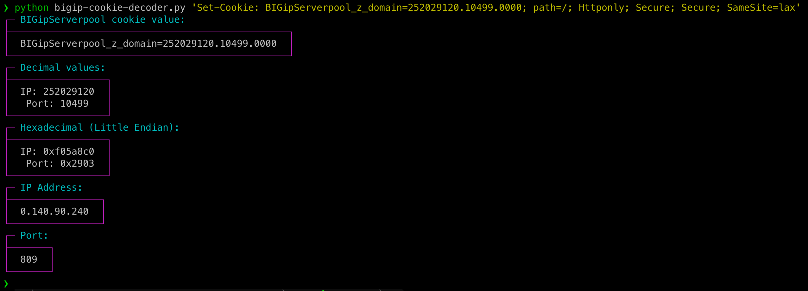

# BIGIP-cookie-decoder
 Extracts the internal IP address and port coded into a BIGip WAF cookie

If we use as example this cookie `'Set-Cookie: BIGipServerpool_z_domain=i557539594.40570.0000; path=/; Httponly;y Secure; SameSite=lax'`
Then we know that the IP is next to `domain=` and next is the port, so we need decode it

We can do this manually in shell this way:
```bash
❯ printf "%#x\n" 557539594
0x213b610a
❯ echo $((0x0a)).$((0x61)).$((0x3b)).$((0x21))
10.97.59.33
❯ printf "%#x\n" 40570
0x9e7a
❯ echo $((0x7a9e))
31390

```
Then understanding the general functionallity, it's possible make it automatic using the full cookie to parse and convert only the values we want
```bash
❯ python bigip-cookie-decoder.py 'Set-Cookie: BIGipServerpool_z_domain=557539594.40570.0000; path=/; Httponly; Secure; SameSite=lax'
┌─ BIGipServerpool cookie value:
├─────────────────────────────────────────────────┐
│  BIGipServerpool_z_domain=557539594.40570.0000  │
└─────────────────────────────────────────────────┘
┌─ Decimal values:
├─────────────────┐
│  IP: 557539594  │
│   Port: 40570   │
└─────────────────┘
┌─ Hexadecimal (Little Endian):
├──────────────────┐
│  IP: 0x213b610a  │
│   Port: 0x9e7a   │
└──────────────────┘
┌─ IP Address:
├───────────────┐
│  10.97.59.33  │
└───────────────┘
┌─ Port:
├─────────┐
│  31390  │
└─────────┘
```


